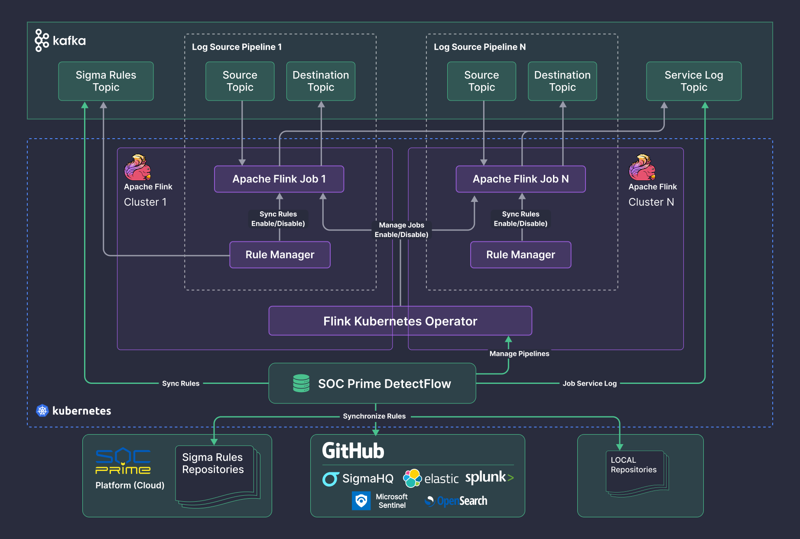

# SOC Prime DetectFlow OSS

Detection intelligence turbocharged with AI. Enable line-speed detection of cyberattacks by equipping your team with AI, trained on 11 years of Detection Intelligence. 

Elevate your daily work from SIEM min-maxing to Detection Orchestration across Data Pipelines, AIDR, EDR, Data Lake, and SIEM. 

Learn more at **[socprime.com](https://socprime.com/)**

- Sub-second MTTD: 0.005–0.01 seconds vs 15+ min for SIEM
- Tags and enriches events in-flight, before SIEM ingestion
- Scales with your infrastructure without vendor-imposed caps
- Applies tens of thousands of Sigma rules on streaming events
- No changes required to SIEM; works with existing ingestion architecture
- Designed for air-gapped and cloud-connected deployment constraints (data stays in your control)

**Result: 10x rule capacity on existing infrastructure.**

## Features in the Current Release
- **Real-time Dashboard** - Live visualization of pipeline performance and metrics
- **Pipeline Management** - Create, configure, and monitor Flink-based ETL pipelines
- **Log Source Configuration** - Define parsing scripts and field mappings for event transformation
- **Rule Management** - Manage Sigma rules from cloud (SOC Prime Platform or SigmaHQ GitHub repository) and local repositories
- **Filter Configuration** - Create pre-filters to reduce false positives
- **Topic Synchronization** - Discover and manage Kafka topics
- **Hot-Reload Support** - Update rules, filters, and parsers without pipeline restart

## Features in Progress
- **Integration with SIEMs, EDRs, and Data Lakes**
    - Splunk
    - Microsoft Sentinel
    - Elasticsearch
    - OpenSearch
- **Integration with LLM Firewall AIDR Bastion** 
- **Detection rules staging**
- **AI-powered data schema validation and remapping**

## System Architecture

DetectFlow consists of the following projects, each in a separate repo:
- [DetectFlow Backend](https://github.com/socprime/detectflow-backend)
- [DetectFlow UI](https://github.com/socprime/detectflow-ui)
- [DetectFlow MatchNode](https://github.com/socprime/detectflow-matchnode)
- [DetectFlow Schema Parser](https://github.com/socprime/detectflow-parser)
- [DetectFlow One-click local deployment](https://github.com/socprime/detectflow-one-click-local-deployment)

Consult each project for more details.
## Requirements
### Technology stack:
- Apache Kafka 3.8+ (https://kafka.apache.org/)
- Kubernetes 1.28+ (https://kubernetes.io/)
- PostgreSQL 14+ (https://www.postgresql.org/)
- Apache Flink 1.13+ (can be deployed together with DetectFlow) (https://flink.apache.org/)

### Network and infrastructure:
- Internal access to deployed resources
- Network connectivity between deployed resources
- Kubernetes cluster with at least 3 nodes(workers) (min 8 vCPUs, 32 GiB RAM each). For a more detailed calculation
- Outbound internet access allowed:
    - to *.socprime.com for API access to the SOC Prime Platform for synchronizing detections (optional, API key needed)
    - to *.github.com for pulling open-source detections using GitHub Integration with public open source repositories, including SigmaHQ, Microsoft, Splunk, and Elastic (optional)

In terms of calculating required resources, the following components of DetectFlow should be considered, with individual requirements for each component summed up to estimate the total amount:
- **User Interface Node (Admin Panel)** is the control center to manage event matching processes. This component requires at least 2 CPUs and 4 GB RAM
- **Task Manager Node**, the default component to control the operation of pipelines (based on match nodes, the Apache Flink technology). This component requires at least 1 CPU and 4 GB RAM
- **Match Node**, a pipeline controlled via Admin Panel that matches detection rules to Apache Kafka topic events. The number of Match Nodes (pipelines) is custom, and you should estimate the required Kubernetes cluster resources based on the number of pipelines you're going to create. 

## Deployment
There are two deployment options:
- **Streamlined, "one-click" deployment** to set up the entire DetectFlow ecosystem locally using Docker and Kubernetes (Minikube). The only prerequisites for this option are macOS with Homebrew and Docker Desktop. You can find all the details of this approach in a separate repository [detectflow-one-click-local-deploymentv](https://github.com/socprime/detectflow-one-click-local-deployment).
- **Full deployment** with separate steps for core components that requires an existing instance of Kubernetes. To perform it, follow the instructions in [FULL_DEPLOYMENT.md](FULL_DEPLOYMENT.md).

## Getting Started
To start using DetectFlow, follow the instructions from [GETTING_STARTED.md](GETTING_STARTED.md).

## License
This SOC Prime DetectFlow software is made available under a dual licensing model: (i) European Union Public License, version 1.2 and (ii) SOC Prime Commercial License. Depending on your intended use, you must choose one of the two licenses. See the [LICENSE](LICENSE) file for details.

